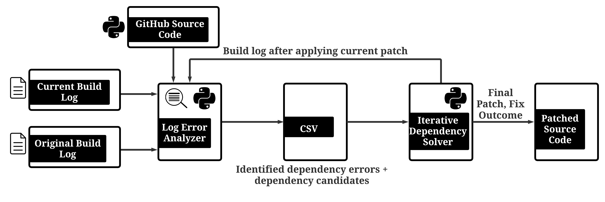

# PyDFix

## About
PyDFix is a tool that helps detect and fix dependency errors that
cause the unreproducibility of Python builds. PyDFix takes as input
the current build log, the original build log and the source code. PyDFix first
identifies dependency errors and possible dependency packages causing
these errors using LogErrorAnalyzer. This is followed by iteratively
building a patch that makes the build reproducible again by Itera-
tiveDependencySolver. The iterative algorithm for building the patch
keeps re-running the build with intermediate patches and analyzing the
new build logs produced to further identify errors and problematic
dependency version specifications. This process continues until the
build becomes reproducible, or all patch options have been tested and
deemed not useful.



# Getting Started
__We recommend the use of a terminal multiplexer like ```tmux``` to run the
processes for PyDFix. This is to prevent the processes from being interrupted
based on connection to the terminal. The tmux command is included in Step 2 of setup.__
## Setup using Docker image (recommended)
&#x1F536;__Requirement: Docker version >= 20.10.3__
&#x1F536; __The estimated running time for the following commands
is: &le;15 minutes.__
### Step 1: Pull PyDFix docker image
```sh
$ sudo docker pull suchita94/pydfix
```
### Step 2: Run container from PyDFix image
```sh
$ tmux
$ sudo docker run -v /var/run/docker.sock:/var/run/docker.sock -v /var/lib/docker:/var/lib/docker --net=host -it suchita94/pydfix
```

### Step 3: Setup Docker permissions
```sh
$ source docker_setup.sh
$ sudo su pydfix
```

### Step 4: Setup Datasets
```sh
$ export PATH=$PATH:/home/pydfix/PyDFix/BugsInPy/framework/bin/
$ source bugsinpy_setup.sh
$ source bugswarm_setup.sh
```

PyDFix can also be set up without using the Docker image, the instructions are
detailed in [this section](#setup-without-docker-image-not-recommended).

# Detailed Description
The replication process is broadly divided into 4 sections as follows:
- *__Step 1__*: [BugSwarm Metrics](#step-1-bugswarm-metrics)
  First we gather data about the frequency of dependency package usage in BugSwarm builds as a part of our motivation. In this step, we will re-create the data presented in __Section 3.1, Figures 2 and 3__ of the
  paper.
- *__Step 2__*:
  [LogErrorAnalyzer](#step-2-logerroranalyzer)
  Next we use the first component of PyDFix, LogErrorAnalyzer which analyzes current build logs and on comparing them with original build logs identifies builds that are unreproducible due to dependency errors. Here, the script will run LogErrorAnalyzer which is described in further detail in __Section
  4.1__ and generate the data produced in __Table 4__ of the paper.
- *__Step 3__*:
  [IterativeDependencySolver](#step-3-iterativedependencysolver)
  The next component of PyDFix is IterativeDependencySolver which takes as input the builds identified in the previous step and iteratively computes a patch comprising of a list of pinned dependencies to make the build reproducible again. This step runs IterativeDependencySolver which is described in detail in __Section 4.2__ on all
  the artifacts identified in Step 2 to generate the data presented in __Table
  5__ of the paper.
- *__Step 4__*: [BugsSwarm Patch Metrics](#step-4-patch-metrics)
  Finally, we gather metrics on the patches computed by PyDFix. In this step, the script will re-create the data shown in __Table 6__ of the paper.
  <br/>
  &nbsp;

__&#x1F534; Note: While running any of the commands associated with any step, errors messages maybe printed to the terminal which are encountered while using a build from the datasets used. Such error messsages *DO NOT* indicate that the command was unsuccessful. Each step prints a message at the end of the run showing the details of the run, and summarizing its results. This message will indicate that the step was successful.__

In the section [Reusing PyDFix](/blob/master/README.md#reusing-pydfix) we have provided a high level overview of the modifications required to extend the work done so far.
## *STEP 1*: BugSwarm Metrics
The following script gathers metrics about dependency packages from original
build logs of BugSwarm artifacts. (Recall that we could not perform this on
BugsInPy due to the absence of original build logs.)<br/>
&#x1F536; __The estimated running time for the following command
is: &le;10 minutes.__
```sh
$ python3 gather_metrics_from_orig_logs.py -path ~/PyDFix -originallogs ~/PyDFix/orig_log_bugswarm
```

Note: The artifacts.json for BugSwarm v1.1.3 is included in the root of the
cloned directory.
### Output: 
This generates a CSV file named ```orig_log_metrics.csv``` which has the following columns.

| Sl | Column Name                               | Column Description                                                          |
|----|-------------------------------------------|-----------------------------------------------------------------------------|
| 1  | Artifact Image Tag                        | Image tag of artifact                                                       |
| 2  | Pass/Fail                                 | Passed or Failed build artifact                                             |
| 3  | Project Dependency Count                  | Total number of dependencies declared within the source code                |
| 4  | Pinned Dependency Count                   | Total number of pinned dependencies declared within the source code         |
| 5  | Constrained Dependency Count              | Total number of constrained dependencies declared within the source code    |
| 6  | Unconstrained Dependency Count            | Total number of unconstrained dependencies declared within the source code  |
| 7  | Transitive Dependency Count               | Total number of transitive dependencies required by the build               |
| 8  | Transitive Pinned Dependency Count        | Total number of pinned transitive dependencies required by the build        |
| 9  | Transitive Constrained Dependency Count   | Total number of constrained transitive dependencies required by the build   |
| 10 | Transitive Unconstrained Dependency Count | Total number of unconstrained transitive dependencies required by the build |
| 11 | Installed Packages                        | Total packages required by the build                                        |

## *STEP 2*: LogErrorAnalyzer
This component of PyDFix runs current build of artifacts from BugSwarm and
BugsInPy and identifies whether the current build has dependency errors that did
not exist in the original build. Since BugsInPy does not contain original build
logs, we use the logs generated by running BugsInPy commands. The detailed technical approach for LogErrorAnalyzer is described in __Section 4.1__ and this section reproduces the data described in __Section 5.2__ and __Table 4__ of the paper. <br/>
&nbsp;

__&#x1F534; Note: For each dataset, we have prepared a representative subset of each dataset to perform a shorter run. Here we mean that the builds included in the subset have final fix outcomes which is in representative proportion of PyDFix's fix outcomes in the original experiments described in the paper.__
&nbsp;

__&#x1F534; Note: The subsets are created purely for the convenience of the evaluator. If the evaluator wishes they can perform the complete Full Runs the commmands for which are also provided in segments following the Subset Runs.__
&nbsp;

__&#x1F534; Note: If the evaluator chooses the perform Subset Runs in this step, the following steps will automatically work on subsets. Step 3 which runs IterativeDependencySolver only works on builds identified by LogErrorAnalyzer and the patch metrics collected in Step 4 will consider the patches generated in Step 3. Thus, choosing to do a subset run in this step will automatically make the future steps consider builds identified from the subset.__

### BugSwarm

#### Subset Run
This runs LogErrorAnalyzer on a subset of 20 BugSwarm builds, which is a representative sample of the entire dataset.<br/>
&#x1F536; __The estimated running time for the following command
is: &le;15 minutes.__
```sh
$ mkdir repro_log_bugswarm
$ python3 bugswarm_log_dependency_analyzer.py -path ~/PyDFix/repro_log_bugswarm -originallogs ~/PyDFix/orig_log_bugswarm -subsetrun
```

#### Full Run
This runs LogErrorAnalyzer on all available BugSwarm builds which have original
source code available on GitHub.<br/>
&#x1F536; __The estimated running time for the following command
is: &le;3 hours.__
```sh
$ mkdir repro_log_bugswarm
$ python3 bugswarm_log_dependency_analyzer.py -path ~/PyDFix/repro_log_bugswarm -originallogs ~/PyDFix/orig_log_bugswarm
```

The output from running these commands is a message printed to the terminal and a file ```
artifacts_dependency_broken.csv ```. These are explained in the [LogErrorAnalyzer Output Section](#output-1).

### BugsInPy 

#### Subset Run
This runs LogErrorAnalyzer on a subset of 20 BugsInPy builds, which is a representative sample of the entire dataset.<br/>
&#x1F536; __The estimated running time for the following command
is: &le;30 minutes.__
```sh
$ mkdir repro_log_bugsinpy 
$ python3 bugsinpy_log_dependency_analyzer.py -path ~/PyDFix/repro_log_bugsinpy -originallogs ~/PyDFix/orig_log_bugsinpy -component ~/PyDFix/BugsInPy -subsetrun
```

#### Full Run
This runs LogErrorAnalyzer on all BugsInPy builds which have setup instructions
available as metadata within the dataset.
##### Without original log generation for BugsInPy [recommended]
The original log generation process which is a one-time process, it time
consuming and takes >3 days to complete for all artifacts in the BugsInPy
dataset. In order to avoid this, we have provided the generated original logs in
the directory ```orig_log_bugsinpy``` from where LogErrorAnalyzer reads the
BugsInPy original logs for each artifact. If you wish to make this run without
using our provided original logs, go to [With original log generation for
BugsInPy](#with-original-log-generation-for-bugsinpy-not-recommended).
<br/>
&#x1F536; __The estimated running time for the following command
is: &le;7 hours.__
```sh
$ mkdir repro_log_bugsinpy
$ python3 bugsinpy_log_dependency_analyzer.py -path ~/PyDFix/repro_log_bugsinpy -originallogs ~/PyDFix/orig_log_bugsinpy -component ~/PyDFix/BugsInPy 
```
##### With original log generation for BugsInPy [NOT recommended]
If you wish to run LogErrorAnalyzer along with the generation of original logs,
use the following commands.<br/>
&#x1F536; __The estimated running time for the following command
is: &le;120 hours.__
```sh
$ mkdir repro_log_bugsinpy
$ rm -rf orig_log_bugsinpy/*
$ python3 bugsinpy_log_dependency_analyzer.py -path ~/PyDFix/repro_log_bugsinpy -originallogs ~/PyDFix/orig_log_bugsinpy -component ~/PyDFix/BugsInPy 
```

The output from running these commands is a message printed to the terminal and a file ``` bugsinpy_artifacts_dependency_broken.csv ```. These are explained in the [LogErrorAnalyzer Output Section](#output-1).

### Output
The output structures of LogErrorAnalyzer are explained in this section.
#### Terminal Message
On running LogErrorAnalyzer on the datasets, a message will be displayed on the terminal in the following format.
```sh
==========**** LogErrorAnalyzer FINAL OUTPUT ****==========
Number of builds identified: <Number of Builds identified by LogErrorAnalyzer as being unreproducible due to dependency packages>
Number of builds available: <Total Number of Builds Analyzed>
Percentage Identification: <Percentage of Builds Identified out of Analyzed Builds>
Total Runtime: <Total time taken to process all artifacts in minutes>
==========**** END OF OUTPUT ****==========
```
If this final message is not displayed, LogErrorAnalyzer has not run correctly.
#### CSV File
Running LogErrorAnalyzer produces the file ```artifacts_dependency_broken.csv``` for BugSwarm and ```bugsinpy_artifacts_dependency_broken.csv``` for BugsInPy. Both these files have the following columns

| Column Name              | Column Description                                                                                                                              |
|--------------------------|-------------------------------------------------------------------------------------------------------------------------------------------------|
| Reproduced Log File Name | Name of log file identified as having dependencies issues e.g., byteweaver-django-coupons-89457803.passed.log                                   |
| Error Line Flagged       | The error message in log file showing dependency-issues e.g., The command ""pip install -r requirements.txt"" failed and exited with 1 during . |
| Possible Candidates      | The list of packages that might be responsible for the issue causing the artifact to be not reproducible                                        |
| File Name                | The requirement file which contains the dependency causing the issue                                                                            |

### Compare results with original experiment
This script is used to compare the results of the latest run performed by
LogErrorAnalyzer on either BugSwarm of BugsInPy artifacts.<br/>
__*Why can the current results differ from original experimental results?*__<br/>
*As explained in the paper, dependency packages may cause unreproducibility through a variety of errors and these may keep changing over time while still causing unreproducibility. Thus, the identification process may identify dependency errors in new builds, while failing to do so in builds previously identified.*

#### Subset Run
```sh
$ python3 compare_logerroranalyzer_results.py -path ~/PyDFix -dataset <1 for BugSwarm 2 for BugsInPy> -subsetrun
```

#### Full Run 
```sh
$ python3 compare_logerroranalyzer_results.py -path ~/PyDFix -dataset <1 for BugSwarm 2 for BugsInPy>
```

This prints to the console the overview of the comparison as shown below:
```sh
Increase(/Decrease) in number identified: <Difference in number of identified artifacts>
New identified: <Number of new artifacts identified>
Not identified from previously identified: <Number of artifacts previously identified ut not in latest run>
Error identified changed: <Number of artifacts identified in both runs, but due to different error>
```
In the above terminal message, we show the change in identified errors through ```Error identified changed``` because this may change the fix outcome of IterativeDependencySolver for these builds. However, a change in the artifacts or errors identified does not indicate that the behavior of PyDFix has changed, but rather that the reason for unreproducibility of the builds analyzed by LogErrorAnalyzer have changed from the time the initial experiments were run.<br/>
The detailed results are provided in 3 csv files:
- &lt;dataset name&gt;_compare_new_found.csv (Listing the new artifacts identified)
- &lt;dataset name&gt;_compare_prev_skipped.csv (Listing artifacts previously
  identified, but not in the latest run)
- &lt;dataset name&gt;_compare_common_diff_error.csv (Artifacts which are identified
  both in original and latest run, comparing old and new errors)

### Re-creating Table 4
This recreates the entries of Table 4 for either BugSwarm or BugsInPy or both. The script aggregates the results of running LogErrorAnalyzer on both BugSwarm and BugsInPy builds and re-creates the data shown in __Table 4__ of the paper and discussed in __Section 5.2__ of the paper. If the results for both the datasets are generated, run this step without the ```-dataset``` option, else specify which dataset is to be considered.
```sh
$ python3 recreate_table4.py -path ~/PyDFix
    (optional) -dataset <1 for BugSwarm, 2 for BugsInPy>
```
Running this command will print the information relevant to Table 4 to the terminal.


## *STEP 3*: IterativeDependencySolver
This component of PyDFix takes as input the csv output of LogErrorAnalyzer and
solves dependency issues in each identified build. The detailed technical
approach of IterativeDependencySolver is provided in __Section 4.2__ of the
paper and this section reproduces the data described in __Section 5.2 and Table 5__ of the paper.
<br/>
*Note: IterativeDependencySolver works on the output of LogErrorAnalyzer. Hence,
if the LogErrorAnalyzer had been only run for the subset of artifacts,
IterativeDependencySolver will automatically work on the builds identified
within the subset.*

### BugSwarm
This runs IterativeDependencySolver on all BugSwarm builds that have been
identified by LogErrorAnalyzer.<br/>
&#x1F536; __The estimated running time for the following command for a subset run 
is: &le;2 hours.__<br/>
&#x1F536; __The estimated running time for the following command for a full run
is: &le;24 hours.__
```sh
$ mkdir sourcecode_bugswarm
$ mkdir intermediates_bugswarm
$ mkdir ~/bugswarm-sandbox
$ python3 bugswarm_automate_iterative_dependency_solve.py -path ~/PyDFix -originallogs ~/PyDFix/orig_log_bugswarm -sourcecode ~/PyDFix/sourcecode_bugswarm -intermediate ~/PyDFix/intermediates_bugswarm
```
The output from running this command is a message printed to the terminal and a
file named ``` iterative_solve_results.csv  ``` which are explained in the
section [IterativeDependencySolver Output Section](#output-2).

### BugsInPy
This runs IterativeDependencySolver on all BugsInPy builds that have been
identified by LogErrorAnalyzer. <br/>
&#x1F536; __The estimated running time for the following command for a subset run
is: &le;3 hours.__
&#x1F536; __The estimated running time for the following command for a full run
is: &le;24 hours.__
```sh
$ mkdir intermediates_bugsinpy
$ python3 bugsinpy_automate_iterative_dependency_solve.py -path ~/PyDFix -originallogs ~/PyDFix/orig_log_bugsinpy -component ~/PyDFix/BugsInPy -intermediates ~/PyDFix/intermediates_bugsinpy
```

The output from running this command is a message printed to the terminal and a
file named ``` bugsinpy_iterative_solve_results.csv  ``` which are explained in the
section [IterativeDependencySolver Output Section](#output-2).

### Output
The output of IterativeDependencySolver is explained in this section.

#### Terminal Message
On running IterativeDependencySolver on the datasets, a message will be displayed on the terminal in the following format.
```sh
==========**** IterativeDependencySolver FINAL OUTPUT ****==========
Number of builds identified: <Number of Builds identified by LogErrorAnalyzer& provided as input>
Complete Fixes: <Number and percentage of builds which were completely fixed>
Partial Fixes: <Number and percentage of builds which were partially fixed>
No Fixes: <Number and percentage of builds which were not fixed>
Total Runtime: <Total time taken to process all artifacts in minutes>
==========**** END OF OUTPUT ****==========
```
If this final message is not displayed, IterativeDependencySolver has not run correctly.
#### CSV File
Running LogErrorAnalyzer produces the file ```iterative_solve_results.csv``` for BugSwarm and ```bugsinpy_iterative_solve_results.csv``` for BugsInPy. Both these files have the following columns

| Column Name   | Column Description                                                                                                                               |
|---------------|--------------------------------------------------------------------------------------------------------------------------------------------------|
| Artifact Name | Identification of the build provided in dataset and failed/passed build                                                                          |
| Final Patch   | The list of dependency version specifications that is proposed as the solution for the unreproducible build                                      |
| Fix Outcome   | Successfully fixed build/Restored to original error (Complete Fix). No longer recognized as dependency error/Exhausted all options (Partial Fix) |
| Time in s     | The total time in seconds required to solve dependency issues in the build                                                                       |
| # Iterations  | The total number of iterations required to solve dependency issues in the build                                                                  |


### Compare results with original experiment
This script is used to compare the results of the latest run performed by
IterativeDependencySolver on either BugSwarm of BugsInPy artifacts.<br/>
*__Why the current results may differ from original experimental results?__*<br/>
*The largely interconnected ecosystem of dependency packages is ever evolving. Thus, the list of dependency version specifications that can completely/partially fix unreproducibility in builds caused by broken dependencies can change and is one of the main use cases of PyDFix.*
#### Subset Run
```sh
$ python3 compare_iterativedependencysolver_results.py -path ~/PyDFix -dataset <1 for BugSwarm 2 for BugsInPy> -subsetrun
```
#### Full Run
```sh
$ python3 compare_iterativedependencysolver_results.py -path ~/PyDFix -dataset <1 for BugSwarm 2 for BugsInPy>
```
This prints to the console the overview of the comparison as shown below:
```sh
(Increase in/Decrease in/ Same) number of fixes attempted: (Differences in the number of fixes attempted as compared with original experimentf)
Same fix outcome count: (Number of builds having the same outcome as original experiment)
========Improvements=======
No fix to partial fix: (Number of builds that were not fixed in original experiment but were partially fixed in latest run)
No fix to complete fix: (Number of builds that were not fixed in original experiment but were completely fixed in latest run)
Partial fix to complete fix: (Number of builds that were partially fixed in original experiment but were partially fixed in latest run)
========Deterioration=======
Complete fix to no fix: (Number of builds that were completely fixed in original experiment but were not fixed in latest run)
Complete fix to partial fix: (Number of builds that were completely fixed in original experiment but were partially fixed in latest run)
Partial fix to no fix: (Number of builds that were partially fixed in original experiment but were not fixed in latest run)
```
The detailed results are provided in 7 csv files:
- &lt;dataset name&gt;_compare_same_fix_outcome.csv (Builds having same fix outcome)
- &lt;dataset name&gt;_compare_nofix_to_partial.csv (Builds that were not fixed in original experiment but were partially fixed in latest run)
- &lt;dataset name&gt;_compare_nofix_to_complete.csv (Builds that were not fixed in original experiment but were completely fixed in latest run)
- &lt;dataset name&gt;_compare_partial_to_complete.csv (Builds that were partially fixed in original experiment but were partially fixed in latest run)
- &lt;dataset name&gt;_compare_complete_to_nofix.csv (Builds that were completely fixed in original experiment but were not fixed in latest run)
- &lt;dataset name&gt;_compare_complete_to_partial.csv (Builds that were completely fixed in original experiment but were partially fixed in latest run)
- &lt;dataset name&gt;_compare_partial_to_nofix.csv (Builds that were partially
  fixed in original experiment but were not fixed in latest run)

### Re-creating Table 5
This step can be used to recreate Table 5 entries for either BugSwarm or BugsInPy or both. This script recreates the performance of IterativeDependencySolver on identified builds from BugSwarm and BugsInPy as presented in Table 5 and discussed in Section 5.2 of the paper. If the results for both the datasets are generated, run this step without the ```-dataset``` option, else specify which dataset is to be considered.
```sh
$ python3 recreate_table5.py -path ~/PyDFix
    (optional) -dataset <1 for BugSwarm, 2 for BugsInPy>
```
Running this command will print the information relevant to Table 5 to the
terminal.

## *STEP 4*: Patch Metrics
### BugSwarm Generate Patch Metrics
This script requires all previous steps to have been completed for BugSwarm
(including metrics generation) and
replicates the data represented in the paper in __Table 6__
```sh
$ python3 bugswarm_gather_patch_metrics.py -path ~/PyDFix
```
The output generated by this script is in the format of the data shown in
__Table6__ and is as follows:
```sh
==========**** BugSwarm Patch Metrics ****==========
Pinned Dependencies:
All:{} Complete:{} Partial:{} Max:{} Average:{}
====================================================
Constrained Dependencies:
All:{} Complete:{} Partial:{} Max:{} Average:{}
====================================================
Unconstrained Dependencies:
All:{} Complete:{} Partial:{} Max:{} Average:{}
====================================================
Project Dependencies:
All:{} Complete:{} Partial:{} Max:{} Average:{}
====================================================
Transitive Dependencies:
All:{} Complete:{} Partial:{} Max:{} Average:{}
====================================================
Overall Dependencies:
All:{} Complete:{} Partial:{} Max:{} Average:{}
==========**** END OF OUTPUT ****==========
```
The script also generates a file named ```patch_metrics.csv``` which has the
following columns.
| Column Name   | Column Description                                                                |
|---------------|-----------------------------------------------------------------------------------|
| Artifact Name | Identification of the build using image tag provided in dataset and failed/passed |
| Transitive    | Count of Transitive dependencies                                                  |
| Project       | Count of Project dependencies                                                     |
| Pinned        | Count of Pinned dependencies                                                      |
| Constrained   | Count of Constrained dependencies                                                 |
| Unconstrained | Count of Unconstrained dependencies|


&nbsp;

#### This is the end of the replication process for PyDFix experiments.
&nbsp;
----------
&nbsp;

# Reusing PyDFix

## Adding New Error Patterns

The set of error patterns currently included in PyDFix's LogErrorAnalyzer is collected manually and is not an exhausting set. However, this set can be easily expanded by adding new regular expressions corresponding to new error patterns observed in build logs to the list in the file ```error_patterns.py```. For each new error pattern added, a type needs to be assigned to the pattern in the file ```error_type.py```. Modifying these 2 files will ensure that LogErrorAnalyzer detects the new error patterns in the build logs it analyzes. After the detection stage, LogErrorAnalyzer will attempt to extract the dependency packages and dependency specification files that are potentially causing the error by analyzing the error lines using the type of matched error. Thus, for every new error added, the identification of dependency packages and specification files needs to be modified to take into account these new errors in the method ```extract_pkg_file_nm``` provided in the file ```error_analyzer_utils.py```.

## Running PyDFix on new Python bug datasets

Bug datasets do not follow any particular template structure and hence, PyDFix as a tool cannot be run on a new dataset without modification. The essential components required in a new dataset for PyDFix to work on it is as follows:
- Source Code
- TravisCI Current Build Log (Build log generated when the build is run at present)
- TravisCI Original Build Log (Build log generated when the build was first run)
- Travis Build Script or .travis.yml (If this is not included in the dataset, it can be easily generated using ```travis_yml_generator.py``` as we did in the case of BugsInPy```)

__Re-Usable Components:__ The following components of PyDFix are entirely re-usable and do not require modification for working on a new dataset:
- build_log_const.py
- build_outcome_type.py
- dependency_analyzer_const.py
- dependency_analyzer_utils.py
- error_analyzer_utils.py
- error_patterns.py
- error_type.py
- final_outcome.py
- package_info.py
- solver_utils.py

Using the components listed above, 2 new scripts need to be created for every new dataset: 1 for running LogErrorAnalyzer and 1 for Running IterativeDependencySolver on artifacts of the data set. For example the scripts ```bugsinpy_log_dependency_analyzer.py``` and ```bugsinpy_automate_iterative_dependency_solve.py``` run PyDFx on BugsInPy while ```bugswarm_log_dependency_analyzer.py``` and ```bugswarm_automate_iterative_dependency_solve.py``` run PyDFix on BugSwarm.

## Running PyDFix on any Python build

PyDFix can also be run on any Python build. The same components required in new datasets for PyDFix to work on them are also required in a Python build. Using the re-usable components of PyDFix, it can be run on any Python build.

----------
&nbsp;


## Setup without Docker image (not recommended)
This method of setup is not recommended as there may be unprecedented errors
depending on system configuration.
Follow the steps provided below to setup PyDFix locally.
### Step 1: Clone PyDFix repository

```sh
$ git clone https://github.com/ucd-plse/PyDFix.git 
```

### Step 2: Set current working directory to cloned directory
```sh
$ cd PyDFix
```

### Step 3: Change permissions of the cloned directory
```sh
$ sudo chmod -R 777 provision.sh 
```

### Step 4: Create and activate virtual environment
```sh
$ virtualenv -p python3.8 venv
$ . venv/bin/activate 
```

### Step 5: Run provision script
```sh
$ ./provision.sh 
```
After completing the above steps, resume from [Detailed Description](#detailed-description)
